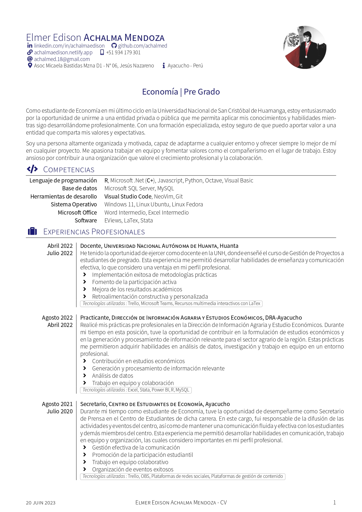
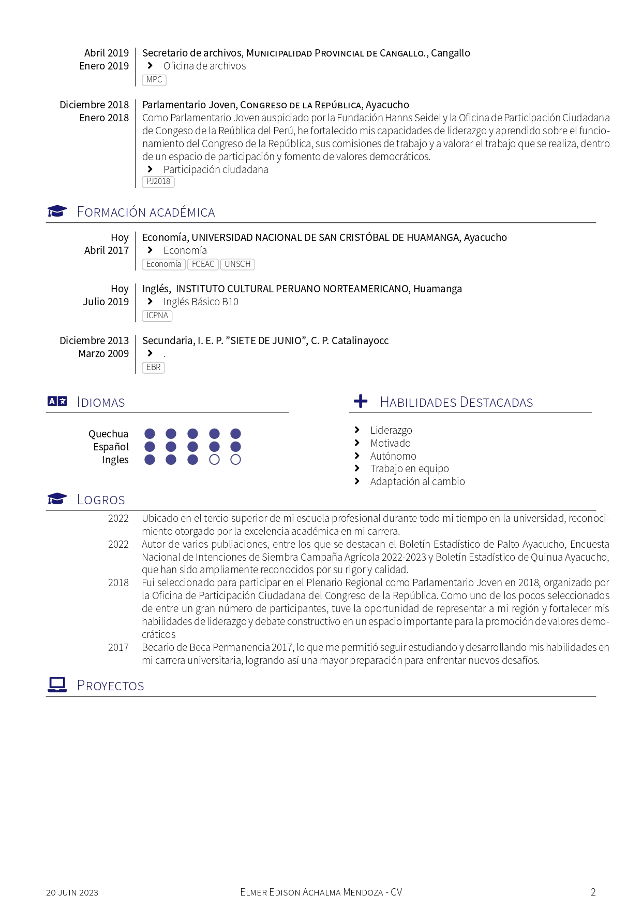
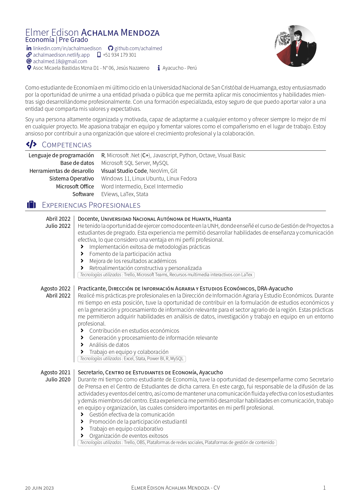

# CV 

#readme

## Vista previa

### Estilo normal

|               Page. 1                |               Page. 2                |
| :----------------------------------: | :----------------------------------: |
|  |  |

### Estilo alternativo

|                     Page. 1                      |                     Page. 2                      |
| :----------------------------------------------: | :----------------------------------------------: |
|  |  |
