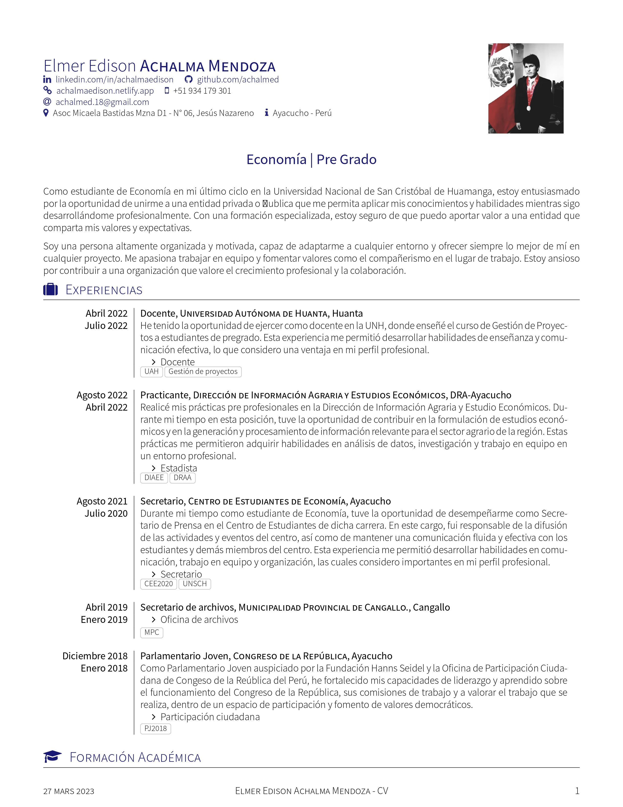
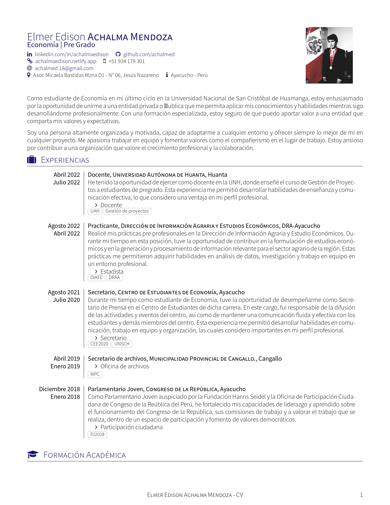
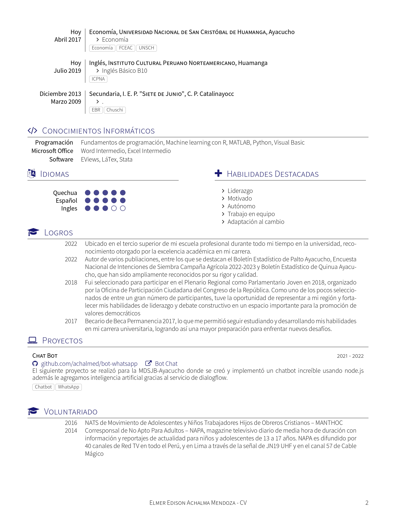

YAAC: Another Awesome CV [](https://circleci.com/gh/darwiin/yaac-another-awesome-cv) [](https://github.com/achalmed/Curriculum-Vitae/blob/master/cv/cv.pdf)
=================

## Inicio rápido

Puede editar en línea **YAAC: otra plantilla de CV impresionante** en [Overleaf](https://www.overleaf.com/latex/templates/awesome-source-cv/wrdjtkkytqcw). No dude en utilizar mi [enlace de referencia](https://www.overleaf.com/signup?ref=54c221604cd6) si desea crear su cuenta.

## Acerca de

**YAAC: Another Awesome CV** se basó primero en una plantilla de CV de Alessandro Plasmati. Esta plantilla usó el motor _XeLaTeX_ y la fuente _[Fontin Sans](http://www.exljbris.com/fontinsans.html)_.

**Datos personales** se movió a la parte superior de la primera página justo antes de la posición y la fuente _[Fontin Sans](http://www.exljbris.com/fontinsans.html)_ se reemplazó por _[Source Sans Pro Fuente](https://github.com/adobe-fonts/source-sans-pro)_ de Adobe. Los íconos _[Font Awesome](http://fontawesome.io/)_ resaltan elementos importantes.

A diferencia de la plantilla de CV _Alessandro Plasmati_, todo el diseño en **YAAC: Another Awesome CV** se ha trasladado al archivo de clase de Latex _documentMETADATA.cls_ para mejorar la legibilidad del código fuente y la reutilización del estilo.

Puede encontrar más información sobre la plantilla original de Alessandro Plasmati aquí:

- [Scribd](http://fr.scribd.com/doc/16335667/Writing-your-Professional-CV-with-LaTeX)
- [LaTeX Templates](http://www.latextemplates.com/template/plasmati-graduate-cv)
- [ShareLatex](https://www.sharelatex.com/templates/cv-or-resume/professional-cv)

## Vista previa

### Estilo normal

| Page. 1 | Page. 2 |
|:---:|:---:|
|  |  |

### Estilo alternativo

| Page. 1 | Page. 2 |
|:---:|:---:|
|  |  |

## Cómo usar **YAAC: Otra clase impresionante de látex CV**

### Usa las opciones de **YAAC: Otro Currículum Impresionante**

Al declarar `\documentclass`, puede usar la(s) opción(es) para personalizar la representación de su CV.

1. **localFont** para usar las fuentes incluidas en la carpeta _fonts_
2. **alternative** para usar el diseño de _encabezado alternativo_
3. **10pt** o **11pt** o **12pt** para cambiar el tamaño de fuente
4. **compact** para reducir el espacio vertical entre las entradas de su experiencia

```latex
% Usado sin opción, la plantilla usará el'traditional' 
% diseño de encabezado las fuentes de su sistema y el esquema de color predeterminado, es decir. azul
\documentclass{yaac-another-awesome-cv}

% Usado con la opción localFont, la plantilla usará el 'traditional'
% diseño de encabezado, fuentes incluidas en el directorio de fuentes y el esquema de color predeterminado
\documentclass[localFont]{yaac-another-awesome-cv}

% Usado con la opción alternative, la plantilla usará la 'alternative'
% diseño de encabezado, las fuentes de su sistema y el esquema de color predeterminado
\documentclass[alternative]{yaac-another-awesome-cv}

% Usado con localFont, alternative  y opciones de 10pt, la plantilla usará la 'alternative'
% diseño de encabezado, fuentes incluidas en el directorio de fuentes, el esquema de color predeterminado y el tamaño de fuente '10pt'.
% Basado en la clase de documento del artículo, las opciones de tamaño son 10pt, 11pt y 12pt
\documentclass[localFont,alternative,10pt]{yaac-another-awesome-cv}

% Usado con la opción 'compact', la plantilla usará el diseño de experiencia compacto
% Siéntete libre de usar esta opción con las otras que están disponibles
\documentclass[compact]{yaac-another-awesome-cv}

```

### Construye el encabezado

Fuera del envoltorio `\socialinfo`, debe definir los parámetros obligatorios `\name` y `\tagline`.

```latex
% Definir el nombre del autor
% de uso: \name{<nombre>}{<apellido>}
% Obligatorio
\name{Elmer Edison}{Achalma Mendoza}

% Definir foto del autor (opcional)
% de uso:  \photo[<shape: circular, square, roundedsquare, squircle>]{<diameter>}{<photo>}
% La forma de la foto del autor es circular por defecto.
\photo{2.6cm}{profile_picture}

% Definir lema del autor
% de uso:  \tagline{<tag line>} 
% Obligatorio
\tagline{Economía | Pre Grado}
```

La mayoría de las redes sociales tienen su comando para mostrar un enlace en el que se puede hacer clic o una entrada de texto simple.

```latex
% Procesar enlace del autor (opcional)
% Usage: \linkedin{<linked-in-nick>}
\linkedin{achalmaedison}

% Render viadeo del autor (opcional)
% Usage: \viadeo{<viadeo-nick>}
\viadeo{christopheroger}

% Renderizar github del autor (opcional)
% Usage: \github{<github-nick>}
\github{achalmed}

% Renderizar el perfil de stackoverflow del autor (opcional)
% Usage: \stackoverflow{<stackoverflow-user-id>}
\stackoverflow{759643}

% Procesar el perfil de intercambio de pila del autor (opcional)
% Usage: \stackexchange{<stackexchange-user-id>}
\stackexchange{396216}

% Enviar correo electrónico del autor (opcional)
% Usage: \email{<email adress>}
\email{achalmed.18@gmail.com}
```

Pon estos comandos en el envoltorio `\socialinfo`. Siéntase libre de agregar `\\` cuando quiera forzar una nueva línea.

```latex
\socialinfo{
	\linkedin{achalmaedison}
	\github{achalmed}\\
	\personalLink{achalmaedison.netlify.app}
	\smartphone{+51 934 179 301}\\
	\email{achalmed.18@gmail.com}\\
	\address{Asoc Micaela Bastidas Mzna D1 - N° 06, Jesús Nazareno}
	\infos{Ayacucho - Perú}
}
```

Use el comando `\makecvheader` para generar el encabezado.

```latex
\makecvheader
```

### Establecer el tamaño de la columna izquierda

Las secciones comparten el tamaño de la columna izquierda (2,5 cm por defecto). Puede cambiar este tamaño predeterminado usando el comando `\setleftcolumnlength`.

```latex
% Anular la longitud predeterminada de la columna izquierda de (2,5 cm) (opcional)
% de uso: \setleftcolumnlength{1.5cm} para cambiar la longitud de la columna izquierda a 1.5cm
% Recomiendo usar un tamaño entre 1.5cm a 2.5cm
\setleftcolumnlength{1.5cm}
```

### Construye la sección de _comptences_ o _skills_

Para enumerar sus increíbles habilidades como listas de palabras clave, primero debe declarar el entorno de `keywords` y luego completarlo con una lista de palabras clave.

```latex
% Inicie un nuevo entorno de palabras clave para mostrarnos sus increíbles palabras clave
  \begin{keywords}
    
    % Aquí están sus listas de palabras clave agrupadas por categorías
    \keywordsentry{Frameworks}{Spring, Spring Boot, \textbf{Ionic 3}, Angular 2, Angular 4, ZK, JBoss RichFaces}
  \end{keywords}
```

### Construye la sección _experiences_

Para describir sus experiencias, primero debe declarar el entorno `experiences`

```latex
% Begin a new experiences environment to use experience and consultantexperience macro
\begin{experiences}

% Here's go your experiences

\end{experiences}
```

Then you can describe your experiences using **\experience** and **\consultantexperience** entries. Each
entry must be separated by the **\emptyseparator**

```latex
% Begin a new experiences environment to use experience and consultantexperience macro
\begin{experiences}

% The experience entry work as below and can be used to describe a job experience
  \experience
    {End date}      {Experience title}{Enterprise}{Country}
    {Begin date}    {
          experience details
                      \begin{itemize}
                        \item Item 1: _Item 1 description_
                        \item Item 2: _Item 2 description_
                        \item Item 3: _Item 3 description_
                      \end{itemize}
                    }
                    {Technology highlights}

% The emptyseparator macro is used to create white space in your experience
  \emptySeparator

% The consultantexperience macro is very similar to the experience macro, but offer you 
% the possibility tu put client details
  \consultantexperience
    {End date}        {Experience title}{Enterprise}{Country}
    {Begin date}      {Client job title}{Clent enterprise}
                    {
                      experience details
                      \begin{itemize}
                        \item Item 1: _Item 1 description_
                        \item Item 2: _Item 2 description_
                        \item Item 3: _Item 3 description_
                      \end{itemize}
                    }
                    {Technology highlights}
\end{experiences}
```

### Construct the _languages_ section

The _languages_ section use the **skills** environment.

```latex
% Begin a new skills environment and fill it with skill entries
  \begin{skills}

% Render a skill in the skills environment
% Usage: \skill{<skill>}{<level between 1 and 5>}
    \skill{Français}{5}
    \skill{Anglais}{4}

% End the skills environment    
  \end{skills}
```

### Construct the _scolarship_ section

The _scolarship_ section use the **scolarship** environment.

```latex
\begin{scholarship}

  % Render a scholarshipentry in the scolarship environment
  % Usage: \scholarshipentry{<date>}{<description>}
  \scholarshipentry{2007}
    {Master STIC Professionel filière MBDS de l'Université de Nice Sophia Antipolis (Master Informatique spécialité Multimédia, Base de Données et intégration de Systèmes)}
  \scholarshipentry{2005}
    {Licence Sciences et Technologies, Mention Informatique, de l'Université de Nouvelle-Calédonie}
\end{scholarship}
```

### Construct the _projects_ section

The _projects_ section use the **projects** environment.

```latex
\begin{projects}
  \project
    {Simply City}{2017 - 2018}
    {\website{https://www.simplycity.nc}{https://www.simplycity.nc} \website{https://innovation.engie.com/fr/news/actus/territoires/simply-city-lappli-qui-simplifie-la-ville-au-ces-2018-avec-engie/8156}{Présentation CES 2018} }
    {Simply City est une application mobile, gratuite et participative destinée à tous les habitants, visiteurs et touristes qui séjournent dans une ville. L’application permet de connaître toutes les informations et services utiles en temps réel.}
    {Ionic 3,Typescript,Javascript,Visual Studio Code}
        
\end{projects}
```

### Construct the _references_ section

The _references_ section use the **references** environment.

```latex
  \begin{references}

    % Here's go your references

  \end{references}
```

Then you can list your references as follow:

```latex
  \begin{referees}
    \referee
      {John Snow}
      {Lord Commander of the Night Watch}
      {Night Watch}
      {john.snow@nightwatch.org}
      {+687 987 654}

    \referee
      {Géry Loutre}
      {Architecte logiciel}
      {Cafat}
      {ref1@cafat.nc}
      {+687 987 654}

  \begin{referees}
```

### Construya la sección _publicaciones_

La sección _publicaciones_ utiliza el entorno de **publicaciones**.

```latex
  \begin{publications}

    % Aquí van sus referencias

  \end{publications}
```

Entonces puede enumerar sus referencias de la siguiente manera:

```latex
  % Divide la bibliografía por tipo de cita (aquí artículos de revistas)
  \printbibliography[heading=subbibliography,title={Journal Articles},type=article]

  % O para la lista completa sin separar por tipo
  \printbibliography[heading={none}]
```

## License

Latex class file _yaac-another-awesome-cv_ is published under the term of the [LPPL Version 1.3c](https://www.latex-project.org/lppl.txt).

All content files are published under the term of the [CC BY-SA 4.0 License](https://creativecommons.org/licenses/by-sa/4.0/legalcode).
