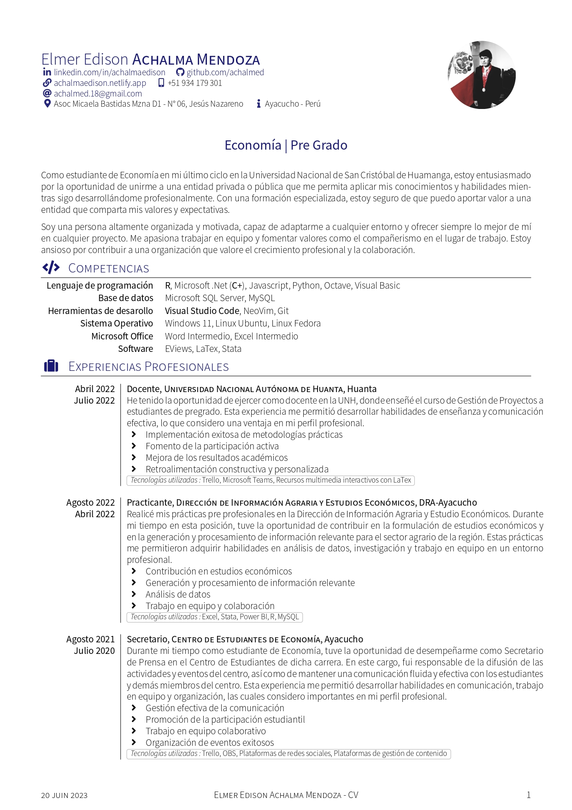
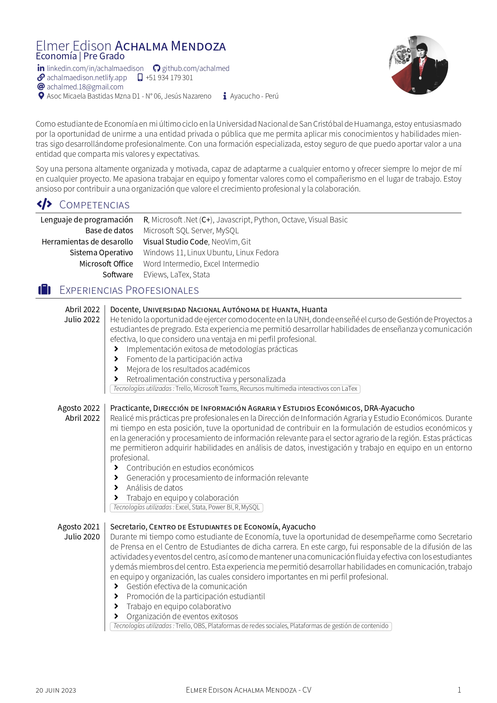
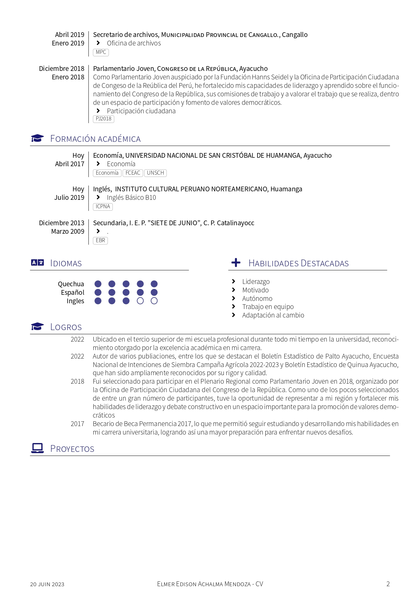

# CV [](https://github.com/achalmed/Curriculum-Vitae/blob/master/cv.pdf)

#readme

# Sistema Modular de CV - Guía de Uso

## 📋 Descripción

Este repositorio contiene un sistema modular para generar CVs personalizados según el área laboral de interés. Cada archivo `.tex` contiene múltiples versiones del contenido (comentadas) que puedes activar/desactivar según la posición a la que postules.

## Vista previa

### Estilo normal

|               Page. 1                |               Page. 2                |
| :----------------------------------: | :----------------------------------: |
|  |  |

### Estilo alternativo

|                     Page. 1                      |                     Page. 2                      |
| :----------------------------------------------: | :----------------------------------------------: |
|  |  |

## 🎯 Áreas Profesionales Cubiertas

1. **Docencia e Investigación** - Universidades, institutos, centros de investigación
2. **Data Science / Análisis de Datos** - Equipos de datos, BI, analytics
3. **Economía / Análisis Económico** - Áreas de estudios, análisis sectorial
4. **Sector Público** - Entidades gubernamentales, políticas públicas
5. **Sector Financiero** - Bancos, financieras, gestión de riesgos
6. **Consultoría / Proyectos** - Consultoras, ONGs, proyectos

## 📁 Estructura de Archivos

```
cv_versions/
├── 1_declaracion_[area].tex     # Perfiles profesionales por área
├── 2_competencias_[area].tex    # Stack técnico personalizado
├── 3_experiencias_[area].tex    # Experiencias relevantes por área
├── 7_proyectos_completo.tex     # Proyectos con versiones comentadas
└── README.md                     # Este archivo
```

## 🚀 Cómo Usar

### Paso 1: Identifica el área de tu postulación

Determina cuál de las 6 áreas profesionales se ajusta mejor a la posición:

- Docencia → usa archivos `*_docencia.tex`
- Data Science → usa archivos `*_data_science.tex`
- Economía → usa archivos `*_economia.tex`
- Sector Público → usa archivos `*_sector_publico.tex`
- Finanzas → usa archivos `*_sector_financiero.tex`
- Consultoría → usa archivos `*_consultoria.tex`

### Paso 2: Copia los archivos base

```bash
# Ejemplo para postulación en Data Science
cp 1_declaracion_data_science.tex 1_declaracion_cv.tex
cp 2_competencias_data_science.tex 2_competencias.tex
cp 3_experiencias_data_science.tex 3_experiencias_corta.tex
cp 7_proyectos_completo.tex 7_proyectos.tex
```

### Paso 3: Activa/desactiva contenido según relevancia

Cada archivo contiene bloques comentados con `%`. Para activar un bloque:

**ANTES (comentado):**

```latex
%\experience
%{Agosto 2025} {Data Analyst}{Institución}{Lugar}
%{Abril 2025} {
%   Descripción de la experiencia...
%}
```

**DESPUÉS (activado):**

```latex
\experience
{Agosto 2025} {Data Analyst}{Institución}{Lugar}
{Abril 2025} {
   Descripción de la experiencia...
}
```

### Paso 4: Personaliza según el puesto específico

Dentro de cada archivo hay **múltiples versiones** del mismo contenido. Elige la que mejor se ajuste:

**Ejemplo en `1_declaracion_data_science.tex`:**

- Versión principal: Data Science general
- Versión alternativa 1: Business Intelligence
- Versión alternativa 2: Data Analyst entry-level
- Versión alternativa 3: Data Engineer
- Versión alternativa 4: Research Data Analyst

**Cómo cambiar de versión:**

1. Comenta el bloque activo actual (añade `%` al inicio de cada línea)
2. Descomenta el bloque que quieres usar (elimina `%` del inicio de cada línea)

### Paso 5: Compila tu CV

```bash
lualatex cv.tex
```

## 💡 Tips de Uso

### Para Docencia

- Activa experiencias de enseñanza y tutorías
- Usa versión de competencias con énfasis en herramientas pedagógicas
- Incluye proyectos educativos y materiales didácticos

### Para Data Science

- Enfatiza proyectos técnicos de GitHub
- Activa experiencias con análisis de datos
- Destaca stack técnico con lenguajes y frameworks

### Para Sector Público

- Usa declaración con compromiso de servicio público
- Menciona conocimiento de sistemas estatales (SIAF, SIGA, SEACE)
- Incluye experiencias en entidades públicas si las tienes

### Para Sector Financiero

- Activa proyectos relacionados con finanzas/riesgos
- Enfatiza conocimientos de Excel financiero y análisis cuantitativo
- Usa terminología del sector (VAN, TIR, scoring, morosidad)

## 📝 Mantenimiento

### Agregar nueva experiencia

1. Abre `3_experiencias_[areas_relevantes].tex`
2. Añade el bloque al inicio (experiencia más reciente primero)
3. Usa el formato establecido:

```latex
\experience
{Fecha Fin} {Cargo}{Institución}{Ciudad}
{Fecha Inicio} {
   Descripción breve de logros y responsabilidades.
   \begin{itemize}
      \item Logro específico 1 con métrica si es posible
      \item Logro específico 2
      \item Tecnología o metodología aplicada
   \end{itemize}
}
{\footnotesize{\emph{Stack:} Herramientas utilizadas}}
\emptySeparator
```

### Actualizar competencias

En `2_competencias_[area].tex`:

```latex
\keywordsentry{Categoría}{Lista de tecnologías/herramientas}
```

Ordena por nivel de dominio: las que mejor dominas primero, en **negrita**.

### Agregar nuevo proyecto

En `7_proyectos_completo.tex`:

```latex
\project
{Nombre del Proyecto}{Año}
{\github{usuario/repo} \website{https://demo.com}{Demo}}
{Descripción concisa del proyecto, problema que resuelve y resultados.}
{Stack tecnológico, metodologías aplicadas}
\emptySeparator
```

## ⚠️ Errores Comunes

1. **Olvidar descomentar todo el bloque**: Si activas una experiencia, asegúrate de descomentar TODAS las líneas del bloque, incluyendo llaves `{}` y `\emptySeparator`.

2. **Mezclar versiones**: No uses declaraciones de "Data Science" con experiencias de "Docencia" a menos que el puesto lo requiera explícitamente.

3. **Demasiada información**: Para cada postulación, activa solo 3-5 experiencias más relevantes. No sobrecargues el CV.

4. **No personalizar**: Aunque tengas versiones pre-escritas, siempre ajusta redacción específica al puesto (palabras clave del anuncio).

## 📊 Estrategia de Uso

### Para cada postulación:

1. **Lee la descripción del puesto** → Identifica palabras clave y requisitos
2. **Elige el área base** → Selecciona archivos correspondientes
3. **Activa experiencias relevantes** → Solo las que demuestren competencias requeridas
4. **Ajusta declaración** → Usa versión que mejor calcé con cultura de la empresa
5. **Revisa proyectos** → Activa solo proyectos que demuestren skills pedidos
6. **Verifica coherencia** → Todo el CV debe contar la misma historia

### Gestión de versiones:

```
cv-postulacion-empresa-fecha/
├── cv.tex (siempre el mismo archivo principal)
├── 1_declaracion_cv.tex (copia del área correspondiente)
├── 2_competencias.tex (personalizada)
├── 3_experiencias_corta.tex (filtrada y ordenada)
└── cv.pdf (resultado final)
```

## 🎓 Filosofía del Sistema

Este sistema te permite:

- ✅ **Mantener UN repositorio** con toda tu historia profesional
- ✅ **Generar CVs personalizados** rápidamente para cada postulación
- ✅ **Reutilizar bloques** sin reescribir desde cero
- ✅ **Actualizar centralmente** y propagar cambios a futuras versiones
- ✅ **Controlar versiones** de tu carrera profesional con Git

## 📬 Contacto

Edison Achalma

- Email: elmer.achalma.09@unsch.edu.pe
- LinkedIn: linkedin.com/in/achalmaedison
- GitHub: github.com/achalmed
- Web: achalmaedison.netlify.app

---

**Última actualización:** Enero 2026
**Versión:** 1.0
**Licencia:** CC BY-SA 4.0
